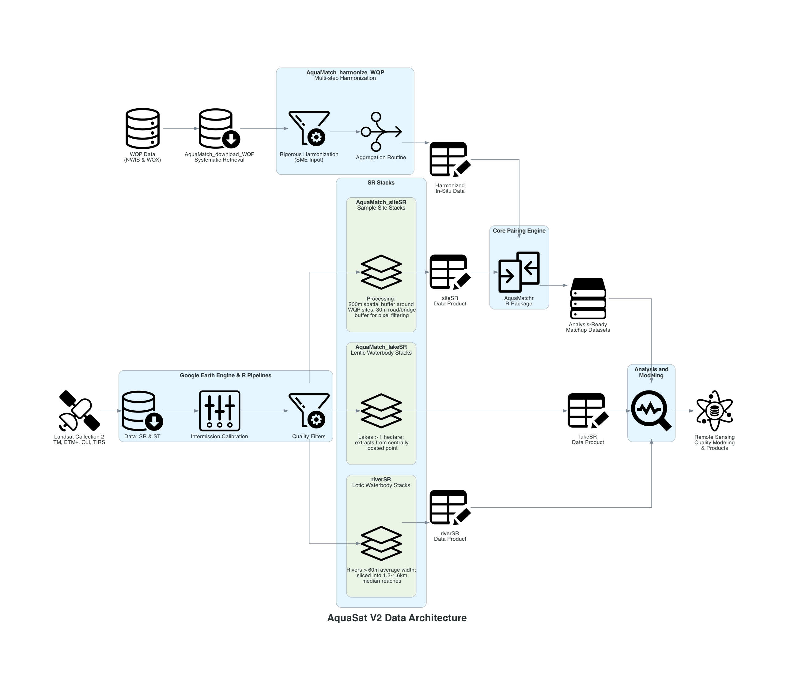

```{r, results = "hide"}
# Set global options to hide code from the final manuscript
knitr::opts_chunk$set(echo = FALSE, warning = FALSE, message = FALSE)

# Load reticulate and activate project-local Python environment
library(reticulate)
use_virtualenv("./.venv", required = TRUE)
```

# Draft figures and code for the AquaSat V2 paper

## 1. Workflow/Data Architecture Diagram

Uses Python {diagrams} library

```{python, results = "hide"}
from diagrams import Diagram, Cluster, Edge
from diagrams.generic.compute import Rack
from diagrams.generic.storage import Storage
from diagrams.custom import Custom

# Default formatting for clusters
cluster_styles = {
    "labeljust": "c",
    "fontname": "Helvetica-Bold",
    "fontsize": "14"
}

# Define the diagram properties (Left-to-Right layout)
with Diagram(
    "<<b>AquaSat V2 Data Architecture</b>>", 
    filename="figs/aquasat_ecosystem", 
    show=False, 
    direction="LR",
    graph_attr={"fontsize": "24"}
):

    # -------------------------------------------------
    # In-Situ Pipeline
    # -------------------------------------------------

    # WQP source input
    wqp_data = Custom("WQP Data\n(NWIS & WQX)", "../resources/uxwing/database-db-icon.png")
        
    # WQP download process
    # This node uses an invisible Cluster to force more white space and prevent text overlaps
    with Cluster("", graph_attr={"style": "invis", "margin": "80.0"}):
        download = Custom("AquaMatch_download_WQP\nSystematic Retrieval", "../resources/uxwing/database-download-icon.png")
   
    # In-situ harmonization process
    with Cluster("<<b>AquaMatch_harmonize_WQP</b><br/>Multi-step Harmonization>",
        graph_attr={"labeljust": "c", "fontname": "Helvetica", "fontsize": "14", "margin": "30,0"}):
        
        harmonization = Custom("  Rigorous Harmonization  \n(SME Input)", "../resources/uxwing/filter-setting-icon.png")
        aggregation = Custom("Aggregation Routine", "../resources/uxwing/consolidation-arrow-icon_point_right.png")
    
    # Harmonized WQP data
    harmonized_output = Custom("Harmonized\nIn-Situ Data", "../resources/uxwing/table-edit-icon.png")
    
    # Flow for Top Pipeline
    wqp_data >> download >> harmonization >> aggregation >> harmonized_output


    # -------------------------------------------------
    # Remote Sensing Pipeline
    # -------------------------------------------------
    
    # Landsat source input
    landsat = Custom("Landsat Collection 2\nTM, ETM+, OLI, TIRS", "../resources/uxwing/satellite-icon.png")
        
    # GEE / R processes
    with Cluster("Google Earth Engine & R Pipelines", graph_attr=cluster_styles):
        gee_data = Custom("Data: SR & ST", "../resources/uxwing/database-download-icon.png")
        gee_cal = Custom("Intermission Calibration", "../resources/uxwing/control-panel-icon.png")
        gee_qual = Custom("Quality Filters", "../resources/uxwing/filter-setting-icon.png")
        
    # Flow for GEE preprocessing
    landsat >> gee_data >> gee_cal >> gee_qual

    # SR stacks
    with Cluster("<<b>SR Stacks</b>>", graph_attr={"labeljust": "c",
    "fontname":"Helvetica", "fontsize": "14", "margin": "25,0"}):
        
        # siteSR
        with Cluster("<<b>AquaMatch_siteSR</b><br/>Sample Site Stacks>",
        graph_attr={"labeljust": "c", "fontname":"Helvetica", "fontsize": "14", "margin": "35,0"}):
            site_sr = Custom("Processing:\n200m spatial buffer around\n WQP sites. 30m road/bridge\n buffer for pixel filtering",
            "../resources/uxwing/layer-icon.png")
            
        # lakeSR
        with Cluster("<<b>AquaMatch_lakeSR</b><br/>Lentic Waterbody Stacks>",
        graph_attr={"labeljust": "c", "fontname":"Helvetica", "fontsize": "14", "margin": "35,0"}):
            lake_sr = Custom("Lakes > 1 hectare;\n extracts from centrally\n located point",
            "../resources/uxwing/layer-icon.png")
            
        # riverSR
        with Cluster("<<b>riverSR</b><br/>Lotic Waterbody Stacks>",
        graph_attr={"labeljust": "c", "fontname":"Helvetica", "fontsize": "14", "margin": "35,0"}):
            river_sr = Custom("Rivers > 60m average width;\n sliced into 1.2-1.6km\n median reaches",
            "../resources/uxwing/layer-icon.png")
            
            
    site_sr_product = Custom("siteSR\nData Product", "../resources/uxwing/table-edit-icon.png")
    lake_sr_product = Custom("lakeSR\nData Product", "../resources/uxwing/table-edit-icon.png")
    river_sr_product = Custom("riverSR\nData Product", "../resources/uxwing/table-edit-icon.png")

    # Connect GEE output to the three stacks, and stacks to their datasets
    gee_qual >> site_sr >> site_sr_product
    gee_qual >> lake_sr >> lake_sr_product
    gee_qual >> river_sr >> river_sr_product

    # -------------------------------------------------
    # Matchups & Modeling
    # -------------------------------------------------
    
    # Matchup process
    with Cluster("Core Pairing Engine", graph_attr=cluster_styles):
        matchups = Custom("AquaMatchr\nR Package", "../resources/uxwing/compare-match-icon.png")
        
    # Completed matchups
    ready_data = Storage("Analysis-Ready\nMatchup Datasets")
    
    # Analysis
    with Cluster("Analysis and\nModeling", graph_attr=cluster_styles):
        analysis = Custom("", "../resources/uxwing/diagnostic-pulse-icon.png")
    
    # Finalized products
    final_product = Custom("Remote Sensing\nQuality Modeling\n& Products", "../resources/uxwing/data-science-icon.png")

    # Connect WQP & siteSR to matchups
    harmonized_output >> matchups
    site_sr_product >> matchups
    
    # Connect matchups out to modeling
    matchups >> ready_data >> analysis >> final_product
    
    # Connect the remaining data products directly to analysis
    lake_sr_product >> analysis
    river_sr_product >> analysis
```

```{r}
# Display the image generated by the Python chunk above

```