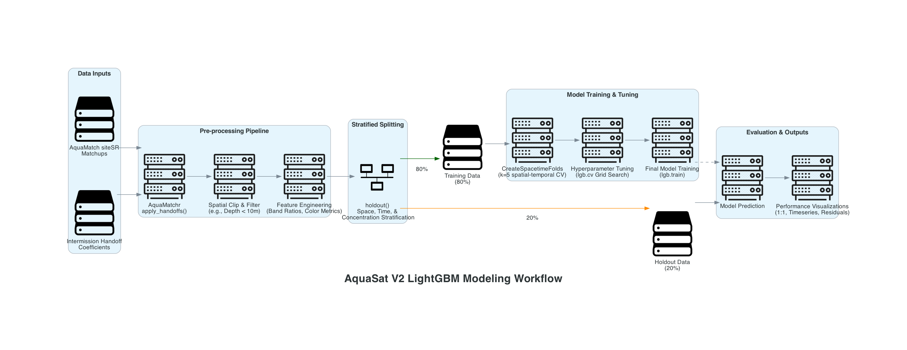

```{r, results = "hide"}
# Set global options to hide code from the final manuscript
knitr::opts_chunk$set(echo = FALSE, warning = FALSE, message = FALSE)

# Point to this before loading reticulate to avoid crash
Sys.setenv(RETICULATE_PYTHON = "./.venv/bin/python")

# Load reticulate and activate project-local Python environment
library(reticulate)
use_virtualenv("./.venv", required = TRUE)
```

# Draft figures and code for the AquaSat V2 paper

## 1. Workflow/Data Architecture Diagram

Uses Python {diagrams} library. Exports to `figs/aquasat_ecosystem.png` and `figs/aquasat_ecosystem.pdf`.

```{python, results = "hide"}
from diagrams import Diagram, Cluster, Edge
from diagrams.generic.compute import Rack
from diagrams.generic.storage import Storage
from diagrams.custom import Custom

# Default formatting for clusters
cluster_styles = {
    "labeljust": "c",
    "fontname": "Helvetica-Bold",
    "fontsize": "14"
}

# Define the diagram properties (Left-to-Right layout)
with Diagram(
    "<<b>AquaSat V2 Data Architecture</b>>", 
    filename="figs/aquasat_ecosystem", 
    show=False, 
    direction="LR",
    outformat=["png", "pdf"],
    graph_attr={"fontsize": "24"}
):

    # -------------------------------------------------
    # In-Situ Pipeline
    # -------------------------------------------------

    # WQP source input
    wqp_data = Custom("WQP Data\n(NWIS & WQX)", "../resources/uxwing/database-db-icon.png")
        
    # WQP download process
    # This node uses an invisible Cluster to force more white space and prevent text overlaps
    with Cluster("", graph_attr={"style": "invis", "margin": "80.0"}):
        download = Custom("AquaMatch_download_WQP\nSystematic Retrieval", "../resources/uxwing/database-download-icon.png")
   
    # In-situ harmonization process
    with Cluster("<<b>AquaMatch_harmonize_WQP</b><br/>Multi-step Harmonization>",
        graph_attr={"labeljust": "c", "fontname": "Helvetica", "fontsize": "14", "margin": "30,0"}):
        
        harmonization = Custom("  Rigorous Harmonization  \n(SME Input)", "../resources/uxwing/filter-setting-icon.png")
        aggregation = Custom("Aggregation Routine", "../resources/uxwing/consolidation-arrow-icon_point_right.png")
    
    # Harmonized WQP data
    harmonized_output = Custom("Harmonized\nIn-Situ Data", "../resources/uxwing/table-edit-icon.png")
    
    # Flow for Top Pipeline
    wqp_data >> download >> harmonization >> aggregation >> harmonized_output


    # -------------------------------------------------
    # Remote Sensing Pipeline
    # -------------------------------------------------
    
    # Landsat source input
    landsat = Custom("Landsat Collection 2\nTM, ETM+, OLI, TIRS", "../resources/uxwing/satellite-icon.png")
        
    # GEE / R processes
    with Cluster("Google Earth Engine & R Pipelines", graph_attr=cluster_styles):
        gee_data = Custom("Data: SR & ST", "../resources/uxwing/database-download-icon.png")
        gee_cal = Custom("Intermission Calibration", "../resources/uxwing/control-panel-icon.png")
        gee_qual = Custom("Quality Filters", "../resources/uxwing/filter-setting-icon.png")
        
    # Flow for GEE preprocessing
    landsat >> gee_data >> gee_cal >> gee_qual

    # SR stacks
    with Cluster("<<b>SR Stacks</b>>", graph_attr={"labeljust": "c",
    "fontname":"Helvetica", "fontsize": "14", "margin": "25,0"}):
        
        # siteSR
        with Cluster("<<b>AquaMatch_siteSR</b><br/>Sample Site Stacks>",
        graph_attr={"labeljust": "c", "fontname":"Helvetica", "fontsize": "14", "margin": "35,0"}):
            site_sr = Custom("Processing:\n200m spatial buffer around\n WQP sites. 30m road/bridge\n buffer for pixel filtering",
            "../resources/uxwing/layer-icon.png")
            
        # lakeSR
        with Cluster("<<b>AquaMatch_lakeSR</b><br/>Lentic Waterbody Stacks>",
        graph_attr={"labeljust": "c", "fontname":"Helvetica", "fontsize": "14", "margin": "35,0"}):
            lake_sr = Custom("Lakes > 1 hectare;\n extracts from centrally\n located point",
            "../resources/uxwing/layer-icon.png")
            
        # riverSR
        with Cluster("<<b>riverSR</b><br/>Lotic Waterbody Stacks>",
        graph_attr={"labeljust": "c", "fontname":"Helvetica", "fontsize": "14", "margin": "35,0"}):
            river_sr = Custom("Rivers > 60m average width;\n sliced into 1.2-1.6km\n median reaches",
            "../resources/uxwing/layer-icon.png")
            
            
    site_sr_product = Custom("siteSR\nData Product", "../resources/uxwing/table-edit-icon.png")
    lake_sr_product = Custom("lakeSR\nData Product", "../resources/uxwing/table-edit-icon.png")
    river_sr_product = Custom("riverSR\nData Product", "../resources/uxwing/table-edit-icon.png")

    # Connect GEE output to the three stacks, and stacks to their datasets
    gee_qual >> site_sr >> site_sr_product
    gee_qual >> lake_sr >> lake_sr_product
    gee_qual >> river_sr >> river_sr_product

    # -------------------------------------------------
    # Matchups & Modeling
    # -------------------------------------------------
    
    # Matchup process
    with Cluster("Core Pairing Engine", graph_attr=cluster_styles):
        matchups = Custom("AquaMatchr\nR Package", "../resources/uxwing/compare-match-icon.png")
        
    # Completed matchups
    ready_data = Storage("Analysis-Ready\nMatchup Datasets")
    
    # Analysis
    with Cluster("Analysis and\nModeling", graph_attr=cluster_styles):
        analysis = Custom("", "../resources/uxwing/diagnostic-pulse-icon.png")
    
    # Finalized products
    final_product = Custom("Remote Sensing\nQuality Modeling\n& Products", "../resources/uxwing/data-science-icon.png")

    # Connect WQP & siteSR to matchups
    harmonized_output >> matchups
    site_sr_product >> matchups
    
    # Connect matchups out to modeling
    matchups >> ready_data >> analysis >> final_product
    
    # Connect the remaining data products directly to analysis
    lake_sr_product >> analysis
    river_sr_product >> analysis
```

```{r}
# Display the image generated by the Python chunk above
knitr::include_graphics("figs/aquasat_ecosystem.png")
```

<br>

## 2a. Hex maps of observation density for each parameter

Exports to `figs/parameter_counts_map.pdf`.

```{r}
library(tidyverse)
library(AquaMatchr)
library(arrow)
library(scales)
library(sf)
library(sfheaders)
library(patchwork)
library(RColorBrewer)
library(ggridges)

# The main four parameters from the OG AquaSat
main_params <- c("chla", "doc", "sdd", "tss")

# Check to see if the files have been downloaded already before proceeding
expected_feathers <- file.path(
  "data", paste0(main_params, "_harmonized.feather")
)

if (all(file.exists(expected_feathers))) {
  # Load existing data if they all exist
  param_data_list <- map(expected_feathers, read_feather)
  names(param_data_list) <- main_params
} else {
  # Download if any are missing
  param_data_list <- download_parameters(parameters = main_params)
}

# CRS to use
map_crs <- 9311

# Conterminous US sf object
conterminous_us <- tigris::states(progress_bar = FALSE) %>%
  st_transform(crs = map_crs) %>%
  filter(!(NAME %in% c("Alaska", "Hawaii", "American Samoa",
                       "Guam", "Puerto Rico",
                       "United States Virgin Islands",
                       "Commonwealth of the Northern Mariana Islands")))

# Other US territories sf object
non_conterminous_us <- tigris::states(progress_bar = FALSE) %>%
  st_transform(crs = 9311) %>%
  filter((NAME %in% c("Alaska", "Hawaii", "American Samoa",
                      "Guam", "Puerto Rico",
                      "United States Virgin Islands",
                      "Commonwealth of the Northern Mariana Islands")))

# Define datums that we'll need to parse:
epsg_codes <- tribble(
  ~datum, ~epsg,
  # American Samoa Datum
  "AMSMA", 4169,
  # Midway Astro 1961
  "ASTRO", 37224,
  # Guam 1963
  "GUAM", 4675,
  # High Accuracy Reference Network for NAD83
  "HARN", 4957,
  # Johnston Island 1961 (Spelled Johnson in WQX)
  "JHNSN", 6725,
  # North American Datum 1927
  "NAD27", 4267,
  # North American Datum 1983
  "NAD83", 4269,
  # Old Hawaiian Datum
  "OLDHI", 4135,
  # Assume WGS84
  "OTHER", 4326,
  # Puerto Rico Datum
  "PR", 4139,
  # St. George Island Datum
  "SGEOR", 4138,
  # St. Lawrence Island Datum
  "SLAWR", 4136,
  # St. Paul Island Datum
  "SPAUL", 4137,
  # Assume WGS84
  "UNKWN", 4326,
  "Unknown", 4326,
  # Wake-Eniwetok 1960
  "WAKE", 37229,
  # World Geodetic System 1972
  "WGS72", 4322,
  # World Geodetic System 1984
  "WGS84", 4326
)

# Stack the list of datasets, add rowids and consolodated main_param col, convert
# all datums to WGS84 and then turn into sf object. FYI, source of this process
# is roughly the plot_tier_maps.R function in AquaMatch_harmonize_WQP pipeline 
stacked_sf_data <- map2(
  .x = param_data_list,
  .y = names(param_data_list),
  .f = \(x, y) x %>%
    # Add umbrella parameter, bc some datasets like "tss" have more than one
    # value in the parameter column (e.g., tss, ssc)
    mutate(main_param = y) %>%
    # Unique indices if needed
    rowid_to_column() %>%
    select(rowid, main_param, parameter, lat, lon, datum)
) %>%
  bind_rows() %>%
  # Treat NA datum as WGS84
  mutate(datum = replace_na(datum, "WGS84")) %>%
  left_join(
    x = .,
    y = epsg_codes,
    by = "datum"
  ) %>%
  # Group by CRS 
  split(f = .$epsg) %>%
  # Transform and re-stack
  map_df(.x = .,
         .f = ~ .x %>%
           st_as_sf(coords = c("lon", "lat"),
                    crs = unique(.x$epsg)) %>%
           st_make_valid() %>%
           st_transform(crs = map_crs))

conterminous_recs_sf <- stacked_sf_data[conterminous_us, ]

map_plot <- sf_to_df(conterminous_recs_sf, fill = TRUE) %>%
  ggplot() +
  geom_hex(aes(x = x, y = y),
           bins = 50) +
  geom_sf(data = conterminous_us,
          color = "black",
          fill = NA) +
  scale_fill_viridis_c("Record count",
                       trans = "log",
                       breaks = breaks_log(n = 6),
                       labels = label_number(scale_cut = cut_short_scale())
  ) +
  xlab(NULL) +
  ylab(NULL) +
  facet_wrap(vars(main_param)) +
  guides(x = guide_axis(check.overlap = TRUE),
         y = guide_axis(check.overlap = TRUE)) +
  ggtitle(
    label = "Record counts across the US by parameter",
    subtitle = paste0(
      "Not shown: ",
      comma(nrow(stacked_sf_data[non_conterminous_us,])),
      " records from outside the conterminous US"
    )) +
  theme_bw() +
  theme(legend.position = "bottom") +
  guides(fill = guide_colorbar(barwidth = 10))

# Return to view
map_plot

# Export as .pdf
ggsave(filename = "figs/parameter_counts_map.pdf", plot = map_plot,
       width = 7.5, height = 5.0, units = "in")

rm(conterminous_recs_sf, stacked_sf_data, map_plot)
gc()
```

## 2b. Concentration distributions for each parameter 

Note: Uses psuedo-log x-axis transformation to handle 0s. Exports to `figs/parameter_distributions.pdf`.

```{r}
# Stack records
stacked_param_data <- map2(
  .x = param_data_list,
  .y = names(param_data_list),
  .f = \(x, y) x %>%
    # Add umbrella parameter, bc some datasets like "tss" have more than one
    # value in the parameter column (e.g., tss, ssc)
    mutate(main_param = y,
           # Use the more fine scale parameter col + unit for distribution labels
           param_label = paste0(parameter, " (", harmonized_units, ")"))
  ) %>%
  bind_rows()

param_distribution_plot <- stacked_param_data %>%
  ggplot() +
  geom_histogram(aes(harmonized_value)) +
  facet_wrap(vars(param_label), scales = "free", ncol = 2) +
  scale_x_continuous(trans = "pseudo_log",
                     breaks = c(0, 10^(0:5))) + 
  ggtitle(label = "Distribution of harmonized values") +
  xlab("Depth or Concentration") +
  ylab("Count") +
  theme_bw() +
  theme(panel.grid = element_blank(),
        axis.text.x = element_text(angle = 45, hjust = 1))

# Return to view
param_distribution_plot

# Export as .pdf
ggsave(filename = "figs/parameter_distributions.pdf", plot = param_distribution_plot,
       width = 7.5, height = 5.0, units = "in")

# Now export the WQP data locally for matchups and to free up memory
if (!all(file.exists(expected_feathers))){
  iwalk(
    .x = param_data_list,
    .f = \(data, name) write_feather(
      x = data, 
      sink = file.path("data", paste0(name, "_harmonized.feather"))
    ))
}

rm(param_data_list, stacked_param_data, param_distribution_plot)
gc()
```


## 3. SR maps

Download datasets if necessary:
```{r}
# siteSR
if (!file.exists("data/siteSR_DSWE1_full_concatenation.feather")) {
  siteSR_paths <- download_siteSR(
    save_location = "data",
    # DSWE1
    algal_mask = FALSE,
    ask = FALSE
  )
}

# lakeSR
if (!file.exists("data/lakeSR_DSWE1_full_concatenation.feather")) {
  lakeSR_paths <- download_lakeSR(
    save_location = "data",
    # DSWE1
    algal_mask = FALSE,
    ask = FALSE
  )
}

# riverSR
if (!file.exists("data/riverSR_usa_v1.1.feather")) {
  riverSR_paths <- download_riverSR(
    save_location = "data",
    timeout_length = 5000
  )
} else {
  riverSR_paths <- "data/riverSR_usa_v1.1.feather"
}

# Download modified NHDplusV2 centerlines from riverSR (not currently implemented
# in AquaMatchr)
if (!file.exists("data/nhdplusv2_modified_v1.0.shp")) {
  zen_rec <- zen4R::get_zenodo(doi = "10.5281/zenodo.4304567")
  zen_files <- zen_rec$listFiles()$filename
  shp_bundle <- grep(pattern = "^nhdplusv2_modified_v1\\.0\\.",
                     x = zen_files,
                     value = TRUE)
  zen4R::download_zenodo(path = "data", doi = "10.5281/zenodo.4304567", 
                         files = shp_bundle, timeout = 4000)
}
```

### siteSR
Work with siteSR first. Will save a temporary ggplot object at `data/siteSR_map_draft.rds`
```{r}
# Check if siteSR has been built before proceeding
siteSR_concat_path <- "data/siteSR_DSWE1_full_concatenation.feather"

if (file.exists(siteSR_concat_path)) {
  full_siteSR <- arrow::open_dataset(siteSR_concat_path, format = "feather")
} else {
  full_siteSR <- build_sr(
    which_sr = "siteSR",
    # Location of downloaded files
    sr_location = "data",
    algal_mask = FALSE,
    # Export as Arrow Table in data/
    save = TRUE, 
    # Defaults to data/siteSR_DSWE1_full_concatenation.feather
    save_location = "data"
  )
}

# Aggregate overpass counts
avg_overpasses_siteSR <- full_siteSR %>%
  mutate(year = year(date)) %>%
  group_by(siteSR_id, year) %>%
  summarize(annual_count = n(), .groups = "drop") %>%
  group_by(siteSR_id) %>%
  summarize(avg_overpasses_per_yr = mean(annual_count), .groups = "drop") %>%
  collect()

# Read in site data
site_data <- read_csv("data/siteSR_collated_WQP_NWIS_sites_with_NHD_info_2025-06-04.csv")

# Join aggregation to locations
map_data_full_siteSR <- avg_overpasses_siteSR %>%
  left_join(x = ., y = site_data, by = "siteSR_id") %>%
  st_as_sf(coords = c("WGS84_Longitude", "WGS84_Latitude"), crs = 4326) %>%
  st_transform(crs = map_crs) 

# Subset to conterminous US
map_data_siteSR <- map_data_full_siteSR[conterminous_us, ] %>%
  mutate(
    proj_x = st_coordinates(geometry)[,1],
    proj_y = st_coordinates(geometry)[,2]
  ) %>%
  # Drop the spatial geometry list-column so it works cleanly with stat_summary_hex
  st_drop_geometry()

# Bbox for map
us_bbox <- st_bbox(conterminous_us)

siteSR_count_map <- map_data_siteSR %>%
  ggplot() +
  stat_summary_hex(
    data = map_data_siteSR, 
    aes(x = proj_x, y = proj_y, z = avg_overpasses_per_yr),
    fun = mean, 
    bins = 50,
    alpha = 0.9
  ) +
  geom_sf(data = conterminous_us,
          color = "black",
          fill = NA) +
  scale_fill_viridis_c(
    name = "Avg Annual Overpasses\nper Site"
  ) +
  xlab(NULL) +
  ylab(NULL) +
  theme_bw() +
  theme(
    plot.title = element_text(face = "bold", margin = margin(b = 10))
  ) +
  labs(
    title = "siteSR: Average Annual Landsat Observations per Site",
    subtitle = "Hex values represent the mean of all sites within the hex"
  ) + 
  coord_sf(
    xlim = c(us_bbox["xmin"], us_bbox["xmax"]),
    ylim = c(us_bbox["ymin"], us_bbox["ymax"]),
    expand = FALSE
  )

# Export the map contents for later use in a multi-panel figure
write_rds(siteSR_count_map, "data/siteSR_map_draft.rds")

# Clear up memory
rm(site_data, full_siteSR, map_data_siteSR, map_data_full_siteSR, avg_overpasses_siteSR, siteSR_count_map, siteSR_paths)
gc()
```

### lakeSR
Will save a temporary ggplot object at `data/lakeSR_map_draft.rds`
```{r}
# Check if lakeSR has been built before proceeding
lakeSR_concat_path <- "data/lakeSR_DSWE1_full_concatenation.feather"

if (file.exists(lakeSR_concat_path)) {
  full_lakeSR <- arrow::open_dataset(lakeSR_concat_path, format = "feather")
} else {
  full_lakeSR <- build_sr(
  which_sr = "lakeSR",
  # Location of downloaded files
  sr_location = "data",
  algal_mask = FALSE,
  # Export as Arrow Table in data/
  save = TRUE, 
  # Defaults to data/lakeSR_DSWE1_full_concatenation.feather
  save_location = "data"
)
}

avg_overpasses_lakeSR <- full_lakeSR %>%
  mutate(year = year(date)) %>%
  group_by(lakeSR_id, year) %>%
  summarize(annual_count = n(), .groups = "drop") %>%
  group_by(lakeSR_id) %>%
  summarize(avg_overpasses_per_yr = mean(annual_count), .groups = "drop") %>%
  collect()

# Read in site data
lake_data <- read_csv("data/lakeSR_poi_with_flags_2025-02-12.csv")

# Join aggregation to locations
map_data_full_lakeSR <- avg_overpasses_lakeSR %>%
  left_join(x = ., y = lake_data, by = "lakeSR_id") %>%
  filter(!is.na(poi_Longitude),
         !is.na(poi_Latitude)) %>%
  st_as_sf(coords = c("poi_Longitude", "poi_Latitude"), crs = 4326) %>%
  st_transform(crs = map_crs) 


# Subset to conterminous US
map_data_lakeSR <- map_data_full_lakeSR[conterminous_us, ] %>%
  mutate(
    proj_x = st_coordinates(geometry)[,1],
    proj_y = st_coordinates(geometry)[,2]
  ) %>%
  # Drop the spatial geometry list-column so it works cleanly with stat_summary_hex
  st_drop_geometry()

lakeSR_count_map <- map_data_lakeSR %>%
  ggplot() +
  stat_summary_hex(
    data = map_data_lakeSR, 
    aes(x = proj_x, y = proj_y, z = avg_overpasses_per_yr),
    fun = mean, 
    bins = 50,
    alpha = 0.9
  ) +
  geom_sf(data = conterminous_us,
          color = "black",
          fill = NA) +
  scale_fill_viridis_c(
    name = "Avg Annual Overpasses\nper Lake"
  ) +
  xlab(NULL) +
  ylab(NULL) +
  theme_bw() +
  theme(
    plot.title = element_text(face = "bold", margin = margin(b = 10))
  ) +
  labs(
    title = "lakeSR: Average Annual Landsat Observations per POI",
    subtitle = "Hex values represent the mean of all lakes within the hex"
  ) + 
  coord_sf(
    xlim = c(us_bbox["xmin"], us_bbox["xmax"]),
    ylim = c(us_bbox["ymin"], us_bbox["ymax"]),
    expand = FALSE
  )

write_rds(lakeSR_count_map, "data/lakeSR_map_draft.rds")

rm(lake_data, full_lakeSR, map_data_lakeSR, map_data_full_lakeSR, avg_overpasses_lakeSR, lakeSR_count_map, lakeSR_paths)
gc()
```

### riverSR
Will save a temporary ggplot object at `data/riverSR_map_draft.rds`
```{r, message=FALSE}
riverSR <- read_feather(riverSR_paths)

river_data <- riverSR %>%
  group_by(ID, year) %>%
  summarize(annual_count = n(), .groups = "drop") %>%
  group_by(ID) %>%
  summarize(avg_overpasses_per_yr = mean(annual_count), .groups = "drop") %>%
  collect()

# Modified nhdplus from Zenodo
river_lines <- read_sf("data/nhdplusv2_modified_v1.0.shp")

map_data_riverSR <- river_lines %>%
  # Join the aggregated reflectance data using the ID column
  inner_join(river_data, by = "ID") %>%
  # Extract Centroids
  st_centroid() %>%
  # Project the new points to match CRS
  st_transform(crs = map_crs) %>%
  # Extract the projected X and Y coordinates for the hex bins
  mutate(
    proj_x = st_coordinates(geometry)[,1],
    proj_y = st_coordinates(geometry)[,2]
  ) %>%
  # Drop the spatial geometry list-column
  st_drop_geometry()

riverSR_count_map <- map_data_riverSR %>%
  ggplot() +
  # Map the hex bins using the newly extracted centroids
  stat_summary_hex(
    data = map_data_riverSR, 
    aes(x = proj_x, y = proj_y, z = avg_overpasses_per_yr),
    fun = mean, 
    bins = 50, 
    alpha = 0.9
  ) +
  geom_sf(data = conterminous_us,
          color = "black",
          fill = NA) +
  scale_fill_viridis_c(
    name = "Avg Annual\nOverpasses\nper Reach") +
  xlab(NULL) +
  ylab(NULL) +
  theme_bw() +
  theme(
    plot.title = element_text(face = "bold", margin = margin(b = 10))
  ) +
  labs(
    title = "riverSR: Average Annual Landsat Observations per Reach",
    subtitle = "Hex values represent the mean of all river reach centroids within the hex"
  ) + 
  coord_sf(
    xlim = c(us_bbox["xmin"], us_bbox["xmax"]),
    ylim = c(us_bbox["ymin"], us_bbox["ymax"]),
    expand = FALSE
  )

write_rds(riverSR_count_map, "data/riverSR_map_draft.rds")

rm(river_data, riverSR_paths, river_lines, map_data_riverSR, riverSR_count_map)
gc()

```

Now, combine the three map figures into a single plot:
```{r}
# Reload the ggplot objects
p_site  <- read_rds("data/siteSR_map_draft.rds")
p_lake  <- read_rds("data/lakeSR_map_draft.rds")
p_river <- read_rds("data/riverSR_map_draft.rds")

# Find the maximum hex value across all three maps
max_site  <- max(ggplot_build(p_site)$data[[1]]$value, na.rm = TRUE)
max_lake  <- max(ggplot_build(p_lake)$data[[1]]$value, na.rm = TRUE)
max_river <- max(ggplot_build(p_river)$data[[1]]$value, na.rm = TRUE)

universal_max <- max(max_site, max_lake, max_river)

# Create a unified color scale
shared_scale <- scale_fill_viridis_c(
  name = "Avg Annual\nOverpasses\nper Location\n(Site/Lake/Reach)",
  limits = c(0, universal_max),
  oob = scales::squish
)

# Overwrite imported scales
p_site_synced  <- p_site + shared_scale
p_lake_synced  <- p_lake + shared_scale
p_river_synced <- p_river + shared_scale

# Combine them (stacking them vertically using '/')
combined_maps <- (p_site_synced / p_lake_synced / p_river_synced) +
  plot_layout(guides = "collect") +
  plot_annotation(tag_levels = 'A')

# Save the unified figure
ggsave("figs/combined_SR_counts_map.pdf", combined_maps, 
       width = 7.5, height = 12, units = "in")
# PNG also for the purpose of including it in this Rmd
ggsave("figs/combined_SR_counts_map.png", combined_maps, 
       width = 7.5, height = 12, units = "in")

rm(riverSR, combined_maps, p_lake, p_lake_synced, p_river, p_river_synced,
   p_site, p_site_synced)
gc()
```
```{r}
knitr::include_graphics("figs/combined_SR_counts_map.png")
```


## 4. Matchup count comparisons

Number of records in situ without matchups, number post matchups.

First perform the matchups:
```{r}
# Chla
chla_matchup_path <- "data/chla_siteSR_DSWE1_matchups.parquet"
if (!file.exists(chla_matchup_path)) {
chla_matchup_path <- match_siteSR_to_WQP(
  wqp_path = "data/chla_harmonized.feather",
  siteSR_path = "data/siteSR_DSWE1_full_concatenation.feather",
  site_list_path = "data/siteSR_collated_WQP_NWIS_sites_with_NHD_info_2025-06-04.csv",
  save_location = "data/chla_siteSR_DSWE1_matchups.parquet",
  time_window = "7 days"
)
}

# DOC
doc_matchup_path <- "data/doc_siteSR_DSWE1_matchups.parquet"
if (!file.exists(doc_matchup_path)) {
doc_matchup_path <- match_siteSR_to_WQP(
  wqp_path = "data/doc_harmonized.feather",
  siteSR_path = "data/siteSR_DSWE1_full_concatenation.feather",
  site_list_path = "data/siteSR_collated_WQP_NWIS_sites_with_NHD_info_2025-06-04.csv",
  save_location = "data/doc_siteSR_DSWE1_matchups.parquet",
  time_window = "7 days"
)
}

# SDD
sdd_matchup_path <- "data/sdd_siteSR_DSWE1_matchups.parquet"
if (!file.exists(sdd_matchup_path)) {
sdd_matchup_path <- match_siteSR_to_WQP(
  wqp_path = "data/sdd_harmonized.feather",
  siteSR_path = "data/siteSR_DSWE1_full_concatenation.feather",
  site_list_path = "data/siteSR_collated_WQP_NWIS_sites_with_NHD_info_2025-06-04.csv",
  save_location = "data/sdd_siteSR_DSWE1_matchups.parquet",
  time_window = "7 days"
)
}

# TSS
tss_matchup_path <- "data/tss_siteSR_DSWE1_matchups.parquet"
if (!file.exists(tss_matchup_path)) {
  tss_matchup_path <- match_siteSR_to_WQP(
    wqp_path = "data/tss_harmonized.feather",
    siteSR_path = "data/siteSR_DSWE1_full_concatenation.feather",
    site_list_path = "data/siteSR_collated_WQP_NWIS_sites_with_NHD_info_2025-06-04.csv",
    save_location = "data/tss_siteSR_DSWE1_matchups.parquet",
    time_window = "7 days"
  )
}
```

Mapping is one option for this type of figure. It seemed most in line with the original AquaSat ms so that's what I've provided here. Exports to `figs/parameter_counts_map_post_matchup.pdf`.

```{r}
matchup_files <- c(
 chla_matchup_path, doc_matchup_path, sdd_matchup_path, tss_matchup_path
)

# Open all four matchup datasets as a stacked df, don't collect yet
stacked_data_arrow <- open_dataset(matchup_files)

stacked_slim_collected <- stacked_data_arrow %>% 
  select(parameter, lat, lon, datum) %>%
  collect() %>%
  mutate(
    main_param = case_when(
      parameter == "ssc" | parameter == "tss" ~ "TSS",
      parameter == "chlorophyll" ~ "Chla",
      parameter == "sdd" ~ "SDD",
      parameter == "doc" ~ "DOC"
    )
  )

post_matchup_plot_data <- stacked_slim_collected %>%
  # Treat NA datum as WGS84
  mutate(datum = replace_na(datum, "WGS84")) %>%
  left_join(
    x = .,
    y = epsg_codes,
    by = "datum"
  ) %>%
  # Group by CRS 
  split(f = .$epsg) %>%
  # Transform and re-stack
  map_df(.x = .,
         .f = ~ .x %>%
           st_as_sf(coords = c("lon", "lat"),
                    crs = unique(.x$epsg)) %>%
           st_make_valid() %>%
           st_transform(crs = map_crs))

conterminous_matchups_sf <- post_matchup_plot_data[conterminous_us, ]

map_plot_matchups <- sf_to_df(conterminous_matchups_sf, fill = TRUE) %>%
  ggplot() +
  geom_hex(aes(x = x, y = y),
           bins = 50) +
  geom_sf(data = conterminous_us,
          color = "black",
          fill = NA) +
  scale_fill_viridis_c("Record count",
                       trans = "log",
                       breaks = breaks_log(n = 6),
                       labels = label_number(scale_cut = cut_short_scale())
  ) +
  xlab(NULL) +
  ylab(NULL) +
  facet_wrap(vars(main_param)) +
  guides(x = guide_axis(check.overlap = TRUE),
         y = guide_axis(check.overlap = TRUE)) +
  ggtitle(label = "Matchup counts across the US by parameter") +
  theme_bw() +
  theme(legend.position = "bottom") +
  guides(fill = guide_colorbar(barwidth = 10))

# Return to view
map_plot_matchups

# Export as .pdf
ggsave(
  filename = "figs/parameter_counts_map_post_matchup.pdf",
  plot = map_plot_matchups, width = 7.5, height = 5.0, units = "in"
)

rm(conterminous_matchups_sf, stacked_slim_collected, post_matchup_plot_data,
   map_plot_matchups, stacked_data_arrow)
gc()
```


## 5. Raw color values for siteSR, uncorrected and corrected

```{r}
# Apply the Gardner polynomial correction relative to LS7

# Quick conversion of .feather to .parquet for concatenated siteSR
parquet_path <- "data/siteSR_DSWE1_full_concatenation.parquet"

if (!file.exists(parquet_path)) {
  data_to_convert <- read_feather(
    "data/siteSR_DSWE1_full_concatenation.feather",
    as_data_frame = FALSE
  )
  # Export as .parquet
  write_parquet(
    data_to_convert, 
    parquet_path
  )
  
  rm(data_to_convert)
  gc()
}

# Now apply handoffs
handoff_path <- apply_handoffs(
  input_path = "data/siteSR_DSWE1_full_concatenation.parquet",
  handoff_path = "data/lakeSR_collated_handoffs_GEEv2025-02-12_QAv2025-06-04.csv",
  correction_method = "Gardner_poly",
  sat_target = "LS7",
  algal_mask = FALSE,
  save_location = "data/siteSR_DSWE1_full_concatenation_corrected.parquet"
)
```

**Note**: Plotting takes place here with a subsample because of the size of the
dataset. Pivoting with the full dataset causes R to crash.
```{r}
# Open connection to the handoff adjusted file
concat_handoffs <- open_dataset("data/siteSR_DSWE1_full_concatenation_corrected.parquet")

# Reproducibility seed
set.seed(351)

# Extract, subsample, and pivot
sr_ridge_data <- concat_handoffs %>%
  # Select necessary subset of cols to avoid bloat
  select(
    mission,
    Uncorrected_Blue = med_Blue, Corrected_Blue = blue_corr_7,
    Uncorrected_Green = med_Green, Corrected_Green = green_corr_7,
    Uncorrected_Red = med_Red, Corrected_Red = red_corr_7,
    Uncorrected_Nir = med_Nir, Corrected_Nir = nir_corr_7,
    Uncorrected_Swir1 = med_Swir1, Corrected_Swir1 = swir1_corr_7,
    Uncorrected_Swir2 = med_Swir2, Corrected_Swir2 = swir2_corr_7
  ) %>%
  # Retrieve into memory
  collect() %>%
  # Keep 5% of rows because the dataset is large and pivoting is a memory heavy
  # task
  slice_sample(prop = 0.1) %>%
  # Pivot for building figure
  pivot_longer(
    cols = -mission,
    names_to = c("status", "band"),
    names_sep = "_",
    values_to = "reflectance"
  ) %>%
  # Filter out extreme outliers by band for plotting purposes
 group_by(band) %>%
  filter(
    reflectance >= quantile(reflectance, 0.01, na.rm = TRUE),
    reflectance <= quantile(reflectance, 0.99, na.rm = TRUE)
  ) %>%
  ungroup() %>%
  mutate(
    status = factor(status, levels = c("Uncorrected", "Corrected")),
    band = factor(band, levels = c("Blue", "Green", "Red", "Nir", "Swir1", "Swir2")),
    # Ensure mission is a factor for the y-axis
    mission = as.factor(mission) 
  )

calibration_ridge_plot_lines <- ggplot(
  sr_ridge_data, aes(x = reflectance, y = mission, color = status)
) +
  geom_density_ridges(
    fill = NA,                 
    # Keeps missions from overlapping vertically
    scale = 0.9,               
    rel_min_height = 0.01,
    linewidth = 0.8            
  ) +
  facet_wrap(vars(band), scales = "free_x", ncol = 3) +
  scale_color_manual(
    name = "Handoff Calibration Status",
    values = c("Uncorrected" = "#E69F00", "Corrected" = "#56B4E9")
  ) +
  labs(
    title = "Landsat Intermission Handoff Calibration (Target: LS7)",
    subtitle = "Comparing raw vs. harmonized surface reflectance distributions\n(Distributions trimmed to the 1st and 99th percentiles for visual clarity)",
    x = "Surface Reflectance",
    y = "Landsat Mission"
  ) +
  theme_ridges(font_size = 12, grid = TRUE, center_axis_labels = TRUE) +
  theme(
    legend.position = "bottom",
    panel.border = element_rect(color = "black", fill = NA, linewidth = 0.5),
    strip.background = element_rect(fill = "grey90", color = "black", linewidth = 0.5),
    strip.text = element_text(face = "bold"),
    panel.background = element_rect(fill = "white", color = NA),
    plot.background = element_rect(fill = "white", color = NA)
  )

# View plot
calibration_ridge_plot_lines

ggsave(filename = "figs/handoff_calibration_ridgelines.pdf",
       plot = calibration_ridge_plot_lines, 
       width = 10, height = 7, units = "in")
```

## 6. Modeling, CO Basin

Start "fresh" with an empty environment for the modeling step
```{r}
# Clear all objects from the global environment
rm(list = ls(all.names = TRUE))

# Detach non-base packages loaded in the session
loaded_pkgs <- names(sessionInfo()$otherPkgs)
if (!is.null(loaded_pkgs)) {
  suppressWarnings(
    invisible(
      lapply(paste0("package:", loaded_pkgs), detach, character.only = TRUE,
             unload = TRUE, force = TRUE)
    )
  )
}

# Free up RAM
gc()
```


### Basic workflow diagram of the modeling process:
Exports as `figs/lightgbm_workflow.pdf`.
```{python}
from diagrams import Diagram, Cluster, Edge
from diagrams.generic.storage import Storage
from diagrams.generic.compute import Rack
from diagrams.generic.network import Subnet

# Define the diagram properties (Left-to-Right layout)
cluster_styles = {
    "labeljust": "c",
    "fontname": "Helvetica-Bold",
    "fontsize": "14"
}

with Diagram(
    "<<b>AquaSat V2 LightGBM Modeling Workflow</b>>", 
    filename="figs/lightgbm_workflow", 
    show=False, 
    direction="LR",
    outformat=["png", "pdf"],
    graph_attr={"fontsize": "24"}
):

    # -------------------------------------------------
    # Data Inputs
    # -------------------------------------------------
    with Cluster("Data Inputs", graph_attr=cluster_styles):
        raw_matchups = Storage("AquaMatch siteSR\nMatchups")
        coefficients = Storage("Intermission Handoff\nCoefficients")

    # -------------------------------------------------
    # Pre-processing & Feature Engineering
    # -------------------------------------------------
    with Cluster("Pre-processing Pipeline", graph_attr=cluster_styles):
        handoffs = Rack("AquaMatchr\napply_handoffs()")
        filtering = Rack("Spatial Clip & Filter\n(e.g., Depth < 10m)")
        features = Rack("Feature Engineering\n(Band Ratios, Color Metrics)")
        
    [raw_matchups, coefficients] >> handoffs >> filtering >> features

    # -------------------------------------------------
    # Data Splitting
    # -------------------------------------------------
    with Cluster("Stratified Splitting", graph_attr=cluster_styles):
        holdout_split = Subnet("holdout()\nSpace, Time, &\n Concentration Stratification")
        
    train_set = Storage("Training Data\n(80%)")
    test_set = Storage("Holdout Data\n(20%)")
    
    features >> holdout_split
    holdout_split >> Edge(label="80%", color="darkgreen") >> train_set
    holdout_split >> Edge(label="20%", color="darkorange") >> test_set

    # -------------------------------------------------
    # LightGBM Training & Tuning
    # -------------------------------------------------
    with Cluster("Model Training & Tuning", graph_attr=cluster_styles):
        cv_folds = Rack("CreateSpacetimeFolds\n(k=5 spatial-temporal CV)")
        grid_search = Rack("Hyperparameter Tuning\n(lgb.cv Grid Search)")
        final_model = Rack("Final Model Training\n(lgb.train)")
        
    train_set >> cv_folds >> grid_search >> final_model

    # -------------------------------------------------
    # Evaluation & Prediction
    # -------------------------------------------------
    with Cluster("Evaluation & Outputs", graph_attr=cluster_styles):
        predict = Rack("Model Prediction")
        plots = Rack("Performance Visualizations\n(1:1, Timeseries, Residuals)")
        
    test_set >> predict
    final_model >> Edge(style="dashed") >> predict
    predict >> plots
```

```{r}
# Display the image generated by the Python chunk above

```


### Data acquisition

Download the CO River Basin if it's not already present
```{r}
library(arrow)
library(AquaMatchr)
library(tidyverse)
library(scales)
library(sf)
library(nhdplusTools)
library(CAST)
library(Metrics)
library(lightgbm)

# Define a persistent local directory
data_dir <- "data/hydrobasins_data"
if (!dir.exists(data_dir)) {
  dir.create(data_dir)
}

# Check if the specific Level 3 shapefile is already in that folder
shp_path <- list.files(
  data_dir, 
  pattern = "hybas_na_lev03_v1c\\.shp$", 
  recursive = TRUE, 
  full.names = TRUE
)

# If the file doesn't exist (length is 0), download and unzip it
if (length(shp_path) == 0) {
  message("Shapefile not found locally. Downloading from HydroBASINS (this may take a minute)...")
  
  url <- "https://data.hydrosheds.org/file/HydroBASINS/standard/hybas_na_lev01-12_v1c.zip"
  options(timeout = 600) 
  
  temp_zip <- tempfile(fileext = ".zip")
  download.file(url, destfile = temp_zip, mode = "wb")
  
  message("Unzipping files...")
  unzip(temp_zip, exdir = data_dir)
  unlink(temp_zip)
  
  # Search again now that the files are extracted to get the exact path
  shp_path <- list.files(
    data_dir, 
    pattern = "hybas_na_lev03_v1c\\.shp$", 
    recursive = TRUE, 
    full.names = TRUE
  )
} else {
  message("Shapefile already exists locally. Skipping download.")
}

# Read and filter for the Colorado River Basin
na_basins <- st_read(shp_path[1], quiet = TRUE)

colorado_sf <- na_basins %>%
  filter(MAIN_BAS == 7030008710) %>%
  st_transform(crs = 9311)
```

### Data prep pre-modeling 

Grab chlorophyll *a* 7-day matchup data, apply handoffs, clip
```{r}
if (!file.exists("data/chla_siteSR_DSWE1_matchups_corrected.parquet")) {
  chla_handoff_path <- apply_handoffs(
    input_path = "data/chla_siteSR_DSWE1_matchups.parquet",
    handoff_path = "data/lakeSR_collated_handoffs_GEEv2025-02-12_QAv2025-06-04.csv",
    correction_method = "Gardner_poly",
    sat_target = "LS7",
    algal_mask = FALSE,
    save_location = "data/chla_siteSR_DSWE1_matchups_corrected.parquet"
  ) 
  } else{
    chla_handoff_path <- "data/chla_siteSR_DSWE1_matchups_corrected.parquet"
  }

chla_handoffs <- read_parquet(chla_handoff_path)

chla_sf <- chla_handoffs %>%
  # Don't remove the original lat/lon columns
  st_as_sf(coords = c("lon", "lat"), crs = 4326, remove = FALSE) %>%
  st_transform(crs = 9311)

# Clip/filter to CO Basin
chla_colorado <- chla_sf %>%
  st_filter(colorado_sf)

cat(
  "Total records retained after clipping to the Colorado River Basin:", 
  comma(nrow(chla_colorado)),
  "\n"
)

# Get HUC8 info
huc8_sf <- get_huc(AOI = colorado_sf, type = "huc08") %>%
  st_transform(crs = 9311)

# Join HUC8 to dataset
chla_colorado_huc8 <- chla_colorado %>%
  st_join(huc8_sf %>% select(huc8, name), join = st_intersects)

# Create dataset ready for modeling:
chla_ml_df <- st_drop_geometry(chla_colorado_huc8)
chla_ml_df <- as.data.frame(chla_ml_df)

rm(chla_sf, colorado_sf, na_basins, chla_colorado, chla_handoffs, chla_colorado_huc8)
gc()
```

Add band ratio and color metrics, following `GardnerLab-Pitt/OhioRiver_SR`

Function definitions from Gardner lab:
```{r}
# Based on https://github.com/GardnerLab-Pitt/OhioRiver_SR/blob/main/05_LC02_Build_Matchups.rmd

# Direct from above script:
chroma <- function(R, G, B) {
  require(colorscience)
  require(tidyverse)

# Convert R,G, and B spectral reflectance to dominant wavelength based
# on CIE chromaticity color space

# see Wang et al 2015. MODIS-Based Radiometric Color Extraction and
# Classification of Inland Water With the Forel-Ule
# Scale: A Case Study of Lake Taihu

# chromaticity.diagram.color.fill()

Xi <- 2.7689*R + 1.7517*G + 1.1302*B
Yi <- 1.0000*R + 4.5907*G + 0.0601*B
Zi <- 0.0565*G + 5.5943*B

x <-  Xi / (Xi + Yi +  Zi)
y <-  Yi / (Xi + Yi +  Zi)
z <-  Zi / (Xi + Yi +  Zi)

# Calculate hue angle
alpha <- atan2( (x - (1/3)), (y - (1/3))) * 180/pi

# Make look up table for hue angle to wavelength conversion
cie <- cccie31 %>%
  dplyr::mutate(a = atan2( (x - (1/3)), (y - (1/3))) * 180/pi) %>%
  dplyr::filter(wlnm <= 700) %>%
  dplyr::filter(wlnm >=380) 

# Find nearest dominant wavelength to hue angle
wl <- cie[as.vector(sapply(alpha,function(x) which.min(abs(x - cie$a)))), 'wlnm']

return(wl)
}

pull_transform <- function(df, maxRGB=1, RGB=F) {
  
  if(RGB == T) { 
    
    maxRGB <- maxRGB
    
    data <- df %>%
      filter_at(vars(Red, Green, Blue), all_vars(.< maxRGB))
    
  }else{ 
    data <- df    

    maxRGB <- df  %>%
      dplyr::select(Red, Green, Blue) %>%
      dplyr::summarise(maxRGB = max(., na.rm=F)) 
    
    maxRGB <- maxRGB$maxRGB
  }
  
  data <- data %>%
    dplyr::mutate(NR = Nir/Red,
                  BR = Blue/Red,
                  GR = Green/Red,
                  SR = Swir1/Red,
                  BG = Blue/Green,
                  RG = Red/Green, 
                  NG = Nir/Green,
                  SG = Swir1/Green,
                  BN = Blue/Nir,
                  GN = Green/Nir,
                  RN = Red/Nir,
                  SN = Swir1/Nir,
                  BS = Blue/Swir1,
                  GS = Green/Swir1,
                  RS = Red/Swir1,
                  NS = Nir/Swir1,
                  R.GN = Red/ (Green + Nir),
                  R.GB = Red/ (Green + Blue),
                  R.GS = Red/ (Green + Swir1),
                  R.BN = Red/ (Blue + Nir),
                  R.BS = Red/ (Blue + Swir1),
                  R.NS = Red/ (Nir + Swir1),
                  G.BR = Green/ (Blue + Red),
                  G.BN = Green / (Blue + Nir),
                  G.BS = Green / (Blue + Swir1),
                  G.RN = Green / (Red + Nir),
                  G.RB = Green / (Red + Blue),
                  G.NS = Green / (Nir + Swir1),
                  B.RG = Blue / (Red + Green),
                  B.RN = Blue / (Red + Nir),
                  B.RS = Blue / (Red + Swir1),
                  B.GN = Blue / (Green + Nir),
                  B.GS = Blue / (Green + Swir1),
                  B.NS = Blue / (Nir + Swir1),
                  N.RG = Nir / (Red + Green),
                  N.RB = Nir / (Red + Blue),
                  N.RS = Nir / (Red + Swir1),
                  N.GB = Nir / (Green + Blue),
                  N.GS = Nir / (Green + Swir1),
                  N.BS = Nir / (Blue  + Swir1),
                  GR2 = (Green + Red) / 2,
                  GN2 = (Green + Nir) / 2,
                  # Adding bloom metrics 
                  BR_G = (Blue - Red) / Green,
                  NS_NR = (Nir - Swir1) / (Red - Swir1),
                  fai = Nir - (Red + (Swir1-Red)*((830-660)/(1650-660))),
                  GCI = Nir/(Green-1),
                  IRG = Red-Green,
                  SABI = (Nir-Red)/(Blue + Green),
                  KIVU = (Blue-Red)/Green,
                  GB = Green/Blue,
                  GNDVI = (Nir-Green)/(Nir+Green),
                  EVI = 2.5*((Nir-Red)/(Nir+((6*Red)-(7.5*Blue))+1)),
                  KAB = 1.67-3.94*log(Blue)+3.78*log(Red),
                  KRL = (((Blue/Red)*Nir)-98)/0.75,
                  N_S = Nir - Swir1,
                  N_R = Nir - Red,
                  ndvi = ((Nir-Red)/(Nir+Red)),
                  ndwi = ((Green- Swir1)/(Green + Swir1)),
                  ndssi = ((Blue - Nir)/ (Blue + Nir)),
                  gn.gn= ((Green- Nir)/ (Green + Nir)))

  color <- data %>% filter(Blue > 0 & Green > 0 & Red > 0) %>% 
    dplyr:: mutate(hue = rgb2hsv(r=Red, g=Green, b=Blue, maxColorValue = maxRGB)[1,],
            saturation = rgb2hsv(r=Red, g=Green,  b=Blue, maxColorValue = maxRGB)[2,],
            bright = rgb2hsv(r=Red, g=Green,  b=Blue, maxColorValue = maxRGB)[3,],
            bright_tot = (Red + Green + Nir +Blue),
            dw = chroma(R=Red, G=Green, B=Blue),
            hexcolor = rgb(r=Red, g=Green, b=Blue, maxColorValue = maxRGB))

  color_na <- data %>% filter(!uniqueID %in% color$uniqueID) %>% 
    dplyr:: mutate(hue = 'NA',
            saturation = 'NA',
            bright = 'NA',
            bright_tot = 'NA',
            dw = 'NA', 
            hexcolor = 'NA',
            dw = as.numeric(dw),
            saturation = as.numeric(saturation),
            hue = as.numeric(hue))

  data <-rbind(color, color_na)

  return(data)
}
```

### Prep and filter data
```{r}
model_prep_data <- chla_ml_df %>%
  rename(
    Red = red_corr_7,
    Green = green_corr_7,
    Blue = blue_corr_7,
    Nir = nir_corr_7,
    Swir1 = swir1_corr_7,
    Swir2 = swir2_corr_7,
    Surface_temp_kelvin = surfacetemp_corr_7
  ) %>%
  mutate(uniqueID = row_number()) %>%
  pull_transform(., RGB = F, maxRGB = 1) 


final_model_data <- model_prep_data %>%
  filter(
    harmonized_value > 0.01,
    # depth < 10m, allow NAs because there are a lot
    harmonized_discrete_depth_value <= 10 |
      is.na(harmonized_discrete_depth_value)
  ) %>% 
  select(siteSR_id, date, lat, lon, huc8, tier, harmonized_value,
         prop_hillShadow, mean_hillShade, Red, Green, Blue, Nir, Swir1, Swir2,
         Surface_temp_kelvin, NR:saturation, dw) %>%
  mutate(
    year = year(date),
    log_harmonized_value = log(harmonized_value)
  )

```

### Train/test holdout

Holdout function definition based on Sam Sillen's code (Gemini rewrite)
```{r}
# https://github.com/GardnerLab-Pitt/OhioRiver_SR/blob/9f4d8d5d8f82b89b999081d22c944977043dc520/04_LC02_model_train_eval.Rmd

# This function randomly samples match-ups across different locations, times, and concentrations for splitting training/validation data
holdout <- function(x) {
  
  x <- x %>%
    # Split up into spatial and temporal groups
    group_by(long_group, time_group) %>% 
    dplyr::mutate(
      # Calculate the percentile rank of each value (0.0 to 1.0)
      pr = percent_rank(harmonized_value),
      
      # Assign buckets based on those percentiles
      mag = case_when(
        pr <= 0.2 ~ 0.2,
        pr <= 0.4 ~ 0.4,
        pr <= 0.6 ~ 0.6,
        pr <= 0.8 ~ 0.8,
        pr <= 0.9 ~ 0.9,
        # Everything above 0.9
        TRUE      ~ 1.0  
      ),
      mag = as.factor(mag)
    ) %>%
    # Drop the temporary percentile column
    select(-pr) %>%
    ungroup()
  
  # Reproducibility
  set.seed(22)
  
  train <- x %>%
    group_by(time_group, long_group, mag) %>%
    # 80% of data will be used for training
    sample_frac(.8) %>% 
    ungroup() %>%
    dplyr::mutate(.partitions = 1)
  
  validate <- x %>%
    anti_join(train) %>%
    dplyr::mutate(.partitions = 2)
  
  out <- train %>%
    bind_rows(validate) 
  
  return(out)
}
```

```{r create-holdouts}
# https://github.com/GardnerLab-Pitt/OhioRiver_SR/blob/9f4d8d5d8f82b89b999081d22c944977043dc520/04_LC02_model_train_eval.Rmd
model_pre_train_prep <- final_model_data %>%
  mutate(
    # Sam Sillen code:
    lat_group = cut_number(lat, 5, right= F),
    long_group = cut_number(lon, 5, right=F),
    # date = lubridate::ymd(date),
    julian = as.numeric(julian.Date(date)),
    space_group = paste0(lat_group, long_group),
    time_group = cut_number(julian, 5, right=F)
  ) %>%
  holdout() %>% 
  ungroup() %>%
  as.data.frame() %>%
  filter_all(all_vars(!is.infinite(.))) %>%
  filter_all(all_vars(!is.nan(.)))

# Training data, 80%
train <- model_pre_train_prep %>%
  filter(.partitions == 1)

# Test set
holdout <- model_pre_train_prep %>%
  filter(.partitions == 2)

# Vars to use
# Features that were in top 20 of previous model run var importance
features <- c("B.GN", "G.BR", "GR2", "IRG", "KRL", "R.BS", "Surface_temp_kelvin",
              "B.RG", "BG", "SR", "EVI", "GB", "GCI", "GN2", "N_S", "SN", "B.GS",
              "B.NS", "G.BN", "G.BS")

# Create cross validation folds for spatial-temporal cross validation
folds <- CreateSpacetimeFolds(train, spacevar = "long_group",
                              timevar = "time_group", k = 5)
```

### Training
```{r train_model}
# Separate features and target variable
train_x <- train %>%
  select(all_of(features)) %>%
  as.matrix()

train_y <- train$log_harmonized_value

# Create LightGBM datasets
dtrain <- lgb.Dataset(data = train_x, label = train_y)

# Define model parameters
params <- list(
  objective = "regression",  # Continuous response variable
  metric = "rmse",            # Root Mean squared error (RMSE)
  boosting = "gbdt",        # Gradient Boosting Decision Tree
  learning_rate = 0.1,      # Learning rate
  lambda = 0
)

param_grid <- expand.grid(
  # eta
  learning_rate = c(0.05, 0.1, 0.3),
  num_leaves = c(15, 31),
  max_depth = c(-1, 5),
  reg_alpha = c(0.01, 0.1, 0.5, 1),
  reg_lambda = c(0.01, 0.1, 0.5, 1)
)

# Loop through each combination of hyperparameters
cv_results <- list()

set.seed(22)

for (i in 1:nrow(param_grid)) {
  params_temp <- list(
    objective = "regression",
    metric = "rmse", 
    learning_rate = param_grid$learning_rate[i],
    num_leaves = param_grid$num_leaves[i],
    max_depth = param_grid$max_depth[i],
    reg_alpha = param_grid$reg_alpha[i],
    reg_lambda = param_grid$reg_lambda[i],
    seed = 122
  )
  
  # Perform cross-validation
  cv_model <- lgb.cv(
    params = params_temp,
    data = dtrain,
    folds = folds$indexOut,
    nrounds = 500,                  # Number of boosting iterations
    early_stopping_rounds = 10,     # Stop early if no improvement
    verbose = -1                   # Print training progress
  )
  # Store results
  cv_results[[i]] <- list(
    params = params_temp,
    best_iter = cv_model$best_iter,
    best_rmse = min(unlist(cv_model$record_evals$valid$rmse$eval))
  )
}

# Find the best combination of hyperparameters
best_result <- cv_results[[which.min(sapply(cv_results, function(x) x$best_rmse))]]
print(best_result)

# Train the final model using the best hyperparameters and number of iterations
final_model <- lgb.train(
  params = best_result$params,
  data = dtrain,
  nrounds = best_result$best_iter,
  verbose = 1
)

lgb.plot.importance(lgb.importance(final_model))
```


### Testing
```{r predict-holdout-set}
holdout_x <- holdout %>%
  select(all_of(features)) %>%
  as.matrix()

holdout_y <- holdout$log_harmonized_value

# Predict from candidate models:
predictions <- predict(final_model, holdout_x)

# Combine the held out data and the predictions
evaluation_data <- data.frame(
  actual = holdout_y,
  predicted = predictions,
  date = holdout$date,
  siteSR_id = holdout$siteSR_id
)
```

### Holdout prediction
```{r plot-holdout-performance}
evaluation_data %>%
  ggplot(aes(x = actual, y = predicted)) +
  geom_point(alpha = 0.6) +
  geom_abline(slope = 1, intercept = 0, color = "red", linetype = "dashed") +
  labs(title = "Holdout: Predicted vs Actual Values",
       x = "Actual Values", y = "Predicted Values") +
  xlim(
    c(min(c(evaluation_data$actual, evaluation_data$predicted)),
      max(c(evaluation_data$actual, evaluation_data$predicted)))) +
  ylim(
    c(min(c(evaluation_data$actual, evaluation_data$predicted)), 
      max(c(evaluation_data$actual, evaluation_data$predicted)))
  ) +
  theme_bw()
```


### Full predicted vs. actual 1:1
```{r predicted-vs-actual}
training_predictions <- predict(final_model, train_x)

train_predicted <- data.frame(
  actual = train_y,
  predicted = training_predictions,
  date = train$date,
  siteSR_id = train$siteSR_id
)

# Tag predictions with whether they were used to train or not
full_predicted <- bind_rows(
  train_predicted %>%
    mutate(origin = "Training set"),
  evaluation_data %>%
    mutate(origin = "Holdout set")
)

full_predicted %>%
  ggplot() +
  geom_abline(slope = 1, intercept = 0, linetype = "dashed", color = "red") +
  geom_point(aes(x = actual, y = predicted, fill = origin),
             pch = 21, color = "black") +
  labs(title = "Full dataset: Predicted vs. Actual values",
       x = "Actual Values", y = "Predicted Values") +
  xlim(
    c(min(c(evaluation_data$actual, evaluation_data$predicted)),
      max(c(evaluation_data$actual, evaluation_data$predicted)))) +
  ylim(
    c(min(c(evaluation_data$actual, evaluation_data$predicted)), 
      max(c(evaluation_data$actual, evaluation_data$predicted)))
  ) +
  theme_bw()
```

<br>

### Timeseries plotting

#### Training timeseries
```{r training-time-series-plot, fig.height = 9, fig.width=7}
# Plot of a subset of the biggest sites
biggest_sites <- full_predicted %>%
  count(siteSR_id) %>%
  arrange(desc(n)) %>%
  head(n = 10) %>%
  pull(siteSR_id)

full_predicted %>%
  filter(
    siteSR_id %in% biggest_sites,
    origin == "Training set"
  ) %>%
  ggplot(aes(x = date)) +
  # Observed
  geom_line(aes(y = actual, linetype = "Observed"), color = "orange") +
  # Predicted
  geom_point(aes(y = predicted, size = "Predicted"),
             pch = 21, color = "black", fill = "salmon") +
  facet_wrap(vars(siteSR_id), scales = "free", ncol = 2) +
  ggtitle("Predicted & actual values of top 10 most populous sites",
          subtitle = "Training set only") +
  theme_bw() +
  theme(
    legend.title = element_blank(),
    legend.position = "bottom"
  )
```

#### Holdout timeseries
```{r holdout-time-series-plot, fig.height = 9, fig.width=7}
# Plot of a subset of the biggest sites
biggest_sites <- full_predicted %>%
  count(siteSR_id) %>%
  arrange(desc(n)) %>%
  head(n = 10) %>%
  pull(siteSR_id)

full_predicted %>%
  filter(
    siteSR_id %in% biggest_sites,
    origin == "Holdout set"
  ) %>%
  ggplot(aes(x = date)) +
  # Observed
  geom_line(aes(y = actual, linetype = "Observed"), color = "orange") +
  # Predicted
  geom_point(aes(y = predicted, size = "Predicted"),
             pch = 21, color = "black", fill = "salmon") +
  facet_wrap(vars(siteSR_id), scales = "free", ncol = 2) +
  ggtitle("Predicted & actual values of top 10 most populous sites",
          subtitle = "Holdout set only") +
  theme_bw() +
  theme(
    legend.title = element_blank(),
    legend.position = "bottom"
  )
```

### Residuals
```{r residual-plot}
full_predicted %>%
  mutate(residuals = actual - predicted) %>%
  ggplot(aes(x = predicted, y = residuals)) +
  # geom_point(alpha = 0.6) +
  geom_hex() +
  geom_hline(yintercept = 0, color = "red", linetype = "dashed") +
  facet_wrap(vars(origin)) +
  labs(title = "Residuals vs Predicted Values", x = "Predicted", y = "Residuals") +
  scale_fill_viridis_c() +
  theme_bw()
```

