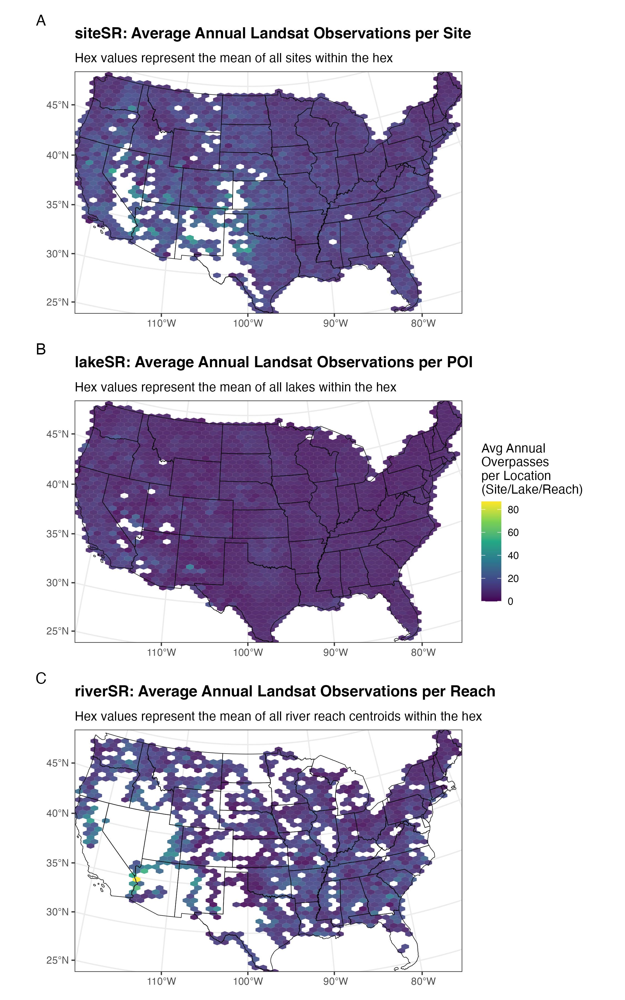

```{r, results = "hide"}
# Set global options to hide code from the final manuscript
knitr::opts_chunk$set(echo = FALSE, warning = FALSE, message = FALSE)

# Load reticulate and activate project-local Python environment
library(reticulate)
use_virtualenv("./.venv", required = TRUE)
```

# Draft figures and code for the AquaSat V2 paper

## 1. Workflow/Data Architecture Diagram

Uses Python {diagrams} library. Exports to `figs/aquasat_ecosystem.png` and `figs/aquasat_ecosystem.pdf`.

```{python, results = "hide"}
from diagrams import Diagram, Cluster, Edge
from diagrams.generic.compute import Rack
from diagrams.generic.storage import Storage
from diagrams.custom import Custom

# Default formatting for clusters
cluster_styles = {
    "labeljust": "c",
    "fontname": "Helvetica-Bold",
    "fontsize": "14"
}

# Define the diagram properties (Left-to-Right layout)
with Diagram(
    "<<b>AquaSat V2 Data Architecture</b>>", 
    filename="figs/aquasat_ecosystem", 
    show=False, 
    direction="LR",
    outformat=["png", "pdf"],
    graph_attr={"fontsize": "24"}
):

    # -------------------------------------------------
    # In-Situ Pipeline
    # -------------------------------------------------

    # WQP source input
    wqp_data = Custom("WQP Data\n(NWIS & WQX)", "../resources/uxwing/database-db-icon.png")
        
    # WQP download process
    # This node uses an invisible Cluster to force more white space and prevent text overlaps
    with Cluster("", graph_attr={"style": "invis", "margin": "80.0"}):
        download = Custom("AquaMatch_download_WQP\nSystematic Retrieval", "../resources/uxwing/database-download-icon.png")
   
    # In-situ harmonization process
    with Cluster("<<b>AquaMatch_harmonize_WQP</b><br/>Multi-step Harmonization>",
        graph_attr={"labeljust": "c", "fontname": "Helvetica", "fontsize": "14", "margin": "30,0"}):
        
        harmonization = Custom("  Rigorous Harmonization  \n(SME Input)", "../resources/uxwing/filter-setting-icon.png")
        aggregation = Custom("Aggregation Routine", "../resources/uxwing/consolidation-arrow-icon_point_right.png")
    
    # Harmonized WQP data
    harmonized_output = Custom("Harmonized\nIn-Situ Data", "../resources/uxwing/table-edit-icon.png")
    
    # Flow for Top Pipeline
    wqp_data >> download >> harmonization >> aggregation >> harmonized_output


    # -------------------------------------------------
    # Remote Sensing Pipeline
    # -------------------------------------------------
    
    # Landsat source input
    landsat = Custom("Landsat Collection 2\nTM, ETM+, OLI, TIRS", "../resources/uxwing/satellite-icon.png")
        
    # GEE / R processes
    with Cluster("Google Earth Engine & R Pipelines", graph_attr=cluster_styles):
        gee_data = Custom("Data: SR & ST", "../resources/uxwing/database-download-icon.png")
        gee_cal = Custom("Intermission Calibration", "../resources/uxwing/control-panel-icon.png")
        gee_qual = Custom("Quality Filters", "../resources/uxwing/filter-setting-icon.png")
        
    # Flow for GEE preprocessing
    landsat >> gee_data >> gee_cal >> gee_qual

    # SR stacks
    with Cluster("<<b>SR Stacks</b>>", graph_attr={"labeljust": "c",
    "fontname":"Helvetica", "fontsize": "14", "margin": "25,0"}):
        
        # siteSR
        with Cluster("<<b>AquaMatch_siteSR</b><br/>Sample Site Stacks>",
        graph_attr={"labeljust": "c", "fontname":"Helvetica", "fontsize": "14", "margin": "35,0"}):
            site_sr = Custom("Processing:\n200m spatial buffer around\n WQP sites. 30m road/bridge\n buffer for pixel filtering",
            "../resources/uxwing/layer-icon.png")
            
        # lakeSR
        with Cluster("<<b>AquaMatch_lakeSR</b><br/>Lentic Waterbody Stacks>",
        graph_attr={"labeljust": "c", "fontname":"Helvetica", "fontsize": "14", "margin": "35,0"}):
            lake_sr = Custom("Lakes > 1 hectare;\n extracts from centrally\n located point",
            "../resources/uxwing/layer-icon.png")
            
        # riverSR
        with Cluster("<<b>riverSR</b><br/>Lotic Waterbody Stacks>",
        graph_attr={"labeljust": "c", "fontname":"Helvetica", "fontsize": "14", "margin": "35,0"}):
            river_sr = Custom("Rivers > 60m average width;\n sliced into 1.2-1.6km\n median reaches",
            "../resources/uxwing/layer-icon.png")
            
            
    site_sr_product = Custom("siteSR\nData Product", "../resources/uxwing/table-edit-icon.png")
    lake_sr_product = Custom("lakeSR\nData Product", "../resources/uxwing/table-edit-icon.png")
    river_sr_product = Custom("riverSR\nData Product", "../resources/uxwing/table-edit-icon.png")

    # Connect GEE output to the three stacks, and stacks to their datasets
    gee_qual >> site_sr >> site_sr_product
    gee_qual >> lake_sr >> lake_sr_product
    gee_qual >> river_sr >> river_sr_product

    # -------------------------------------------------
    # Matchups & Modeling
    # -------------------------------------------------
    
    # Matchup process
    with Cluster("Core Pairing Engine", graph_attr=cluster_styles):
        matchups = Custom("AquaMatchr\nR Package", "../resources/uxwing/compare-match-icon.png")
        
    # Completed matchups
    ready_data = Storage("Analysis-Ready\nMatchup Datasets")
    
    # Analysis
    with Cluster("Analysis and\nModeling", graph_attr=cluster_styles):
        analysis = Custom("", "../resources/uxwing/diagnostic-pulse-icon.png")
    
    # Finalized products
    final_product = Custom("Remote Sensing\nQuality Modeling\n& Products", "../resources/uxwing/data-science-icon.png")

    # Connect WQP & siteSR to matchups
    harmonized_output >> matchups
    site_sr_product >> matchups
    
    # Connect matchups out to modeling
    matchups >> ready_data >> analysis >> final_product
    
    # Connect the remaining data products directly to analysis
    lake_sr_product >> analysis
    river_sr_product >> analysis
```

```{r}
# Display the image generated by the Python chunk above
knitr::include_graphics("figs/aquasat_ecosystem.png")
```

<br>

## 2a. Hex maps of observation density for each parameter

Exports to `figs/parameter_counts_map.pdf`.

```{r}
library(tidyverse)
library(AquaMatchr)
library(arrow)
library(scales)
library(sf)
library(sfheaders)
library(patchwork)


# The main four parameters from the OG AquaSat
main_params <- c("chla", "doc", "sdd", "tss")

# Check to see if the files have been downloaded already before proceeding
expected_feathers <- file.path(
  "data", paste0(main_params, "_harmonized.feather")
)

if (all(file.exists(expected_feathers))) {
  # Load existing data if they all exist
  param_data_list <- map(expected_feathers, read_feather)
  names(param_data_list) <- main_params
} else {
  # Download if any are missing
  param_data_list <- download_parameters(parameters = main_params)
}

# CRS to use
map_crs <- 9311

# Conterminous US sf object
conterminous_us <- tigris::states(progress_bar = FALSE) %>%
  st_transform(crs = map_crs) %>%
  filter(!(NAME %in% c("Alaska", "Hawaii", "American Samoa",
                       "Guam", "Puerto Rico",
                       "United States Virgin Islands",
                       "Commonwealth of the Northern Mariana Islands")))

# Other US territories sf object
non_conterminous_us <- tigris::states(progress_bar = FALSE) %>%
  st_transform(crs = 9311) %>%
  filter((NAME %in% c("Alaska", "Hawaii", "American Samoa",
                      "Guam", "Puerto Rico",
                      "United States Virgin Islands",
                      "Commonwealth of the Northern Mariana Islands")))

# Define datums that we'll need to parse:
epsg_codes <- tribble(
  ~datum, ~epsg,
  # American Samoa Datum
  "AMSMA", 4169,
  # Midway Astro 1961
  "ASTRO", 37224,
  # Guam 1963
  "GUAM", 4675,
  # High Accuracy Reference Network for NAD83
  "HARN", 4957,
  # Johnston Island 1961 (Spelled Johnson in WQX)
  "JHNSN", 6725,
  # North American Datum 1927
  "NAD27", 4267,
  # North American Datum 1983
  "NAD83", 4269,
  # Old Hawaiian Datum
  "OLDHI", 4135,
  # Assume WGS84
  "OTHER", 4326,
  # Puerto Rico Datum
  "PR", 4139,
  # St. George Island Datum
  "SGEOR", 4138,
  # St. Lawrence Island Datum
  "SLAWR", 4136,
  # St. Paul Island Datum
  "SPAUL", 4137,
  # Assume WGS84
  "UNKWN", 4326,
  "Unknown", 4326,
  # Wake-Eniwetok 1960
  "WAKE", 37229,
  # World Geodetic System 1972
  "WGS72", 4322,
  # World Geodetic System 1984
  "WGS84", 4326
)

# Stack the list of datasets, add rowids and consolodated main_param col, convert
# all datums to WGS84 and then turn into sf object. FYI, source of this process
# is roughly the plot_tier_maps.R function in AquaMatch_harmonize_WQP pipeline 
stacked_sf_data <- map2(
  .x = param_data_list,
  .y = names(param_data_list),
  .f = \(x, y) x %>%
    # Add umbrella parameter, bc some datasets like "tss" have more than one
    # value in the parameter column (e.g., tss, ssc)
    mutate(main_param = y) %>%
    # Unique indices if needed
    rowid_to_column() %>%
    select(rowid, main_param, parameter, lat, lon, datum)
) %>%
  bind_rows() %>%
  # Treat NA datum as WGS84
  mutate(datum = replace_na(datum, "WGS84")) %>%
  left_join(
    x = .,
    y = epsg_codes,
    by = "datum"
  ) %>%
  # Group by CRS 
  split(f = .$epsg) %>%
  # Transform and re-stack
  map_df(.x = .,
         .f = ~ .x %>%
           st_as_sf(coords = c("lon", "lat"),
                    crs = unique(.x$epsg)) %>%
           st_make_valid() %>%
           st_transform(crs = map_crs))

conterminous_recs_sf <- stacked_sf_data[conterminous_us, ]

map_plot <- sf_to_df(conterminous_recs_sf, fill = TRUE) %>%
  ggplot() +
  geom_hex(aes(x = x, y = y),
           bins = 50) +
  geom_sf(data = conterminous_us,
          color = "black",
          fill = NA) +
  scale_fill_viridis_c("Record count",
                       trans = "log",
                       breaks = breaks_log(n = 6),
                       labels = label_number(scale_cut = cut_short_scale())
  ) +
  xlab(NULL) +
  ylab(NULL) +
  facet_wrap(vars(main_param)) +
  guides(x = guide_axis(check.overlap = TRUE),
         y = guide_axis(check.overlap = TRUE)) +
  ggtitle(
    label = "Record counts across the US by parameter",
    subtitle = paste0(
      "Not shown: ",
      comma(nrow(stacked_sf_data[non_conterminous_us,])),
      " records from outside the conterminous US"
    )) +
  theme_bw() +
  theme(legend.position = "bottom") +
  guides(fill = guide_colorbar(barwidth = 10))

# Return to view
map_plot

# Export as .pdf
ggsave(filename = "figs/parameter_counts_map.pdf", plot = map_plot,
       width = 7.5, height = 5.0, units = "in")

rm(conterminous_recs_sf, stacked_sf_data, map_plot)
gc()
```

## 2b. Concentration distributions for each parameter 

Note: Uses psuedo-log x-axis transformation to handle 0s. Exports to `figs/parameter_distributions.pdf`.

```{r}
# Stack records
stacked_param_data <- map2(
  .x = param_data_list,
  .y = names(param_data_list),
  .f = \(x, y) x %>%
    # Add umbrella parameter, bc some datasets like "tss" have more than one
    # value in the parameter column (e.g., tss, ssc)
    mutate(main_param = y,
           # Use the more fine scale parameter col + unit for distribution labels
           param_label = paste0(parameter, " (", harmonized_units, ")"))
  ) %>%
  bind_rows()

param_distribution_plot <- stacked_param_data %>%
  ggplot() +
  geom_histogram(aes(harmonized_value)) +
  facet_wrap(vars(param_label), scales = "free", ncol = 2) +
  scale_x_continuous(trans = "pseudo_log",
                     breaks = c(0, 10^(0:5))) + 
  ggtitle(label = "Distribution of harmonized values") +
  xlab("Depth or Concentration") +
  ylab("Count") +
  theme_bw() +
  theme(panel.grid = element_blank(),
        axis.text.x = element_text(angle = 45, hjust = 1))

# Return to view
param_distribution_plot

# Export as .pdf
ggsave(filename = "figs/parameter_distributions.pdf", plot = param_distribution_plot,
       width = 7.5, height = 5.0, units = "in")

# Now export the WQP data locally for matchups and to free up memory
if (!all(file.exists(expected_feathers))){
  iwalk(
    .x = param_data_list,
    .f = \(data, name) write_feather(
      x = data, 
      sink = file.path("data", paste0(name, "_harmonized.feather"))
    ))
}

rm(param_data_list, stacked_param_data, param_distribution_plot)
gc()
```


## 3. SR maps

Download datasets if necessary:
```{r}
# siteSR
if (!file.exists("data/siteSR_DSWE1_full_concatenation.feather")) {
  siteSR_paths <- download_siteSR(
    save_location = "data",
    # DSWE1
    algal_mask = FALSE,
    ask = FALSE
  )
}

# lakeSR
if (!file.exists("data/lakeSR_DSWE1_full_concatenation.feather")) {
  lakeSR_paths <- download_lakeSR(
    save_location = "data",
    # DSWE1
    algal_mask = FALSE,
    ask = FALSE
  )
}

# riverSR
if (!file.exists("data/riverSR_usa_v1.1.feather")) {
  riverSR_paths <- download_riverSR(
    save_location = "data",
    timeout_length = 5000
  )
} else {
  riverSR_paths <- "data/riverSR_usa_v1.1.feather"
}

# Download modified NHDplusV2 centerlines from riverSR (not currently implemented
# in AquaMatchr)
if (!file.exists("data/nhdplusv2_modified_v1.0.shp")) {
  zen_rec <- zen4R::get_zenodo(doi = "10.5281/zenodo.4304567")
  zen_files <- zen_rec$listFiles()$filename
  shp_bundle <- grep(pattern = "^nhdplusv2_modified_v1\\.0\\.",
                     x = zen_files,
                     value = TRUE)
  zen4R::download_zenodo(path = "data", doi = "10.5281/zenodo.4304567", 
                         files = shp_bundle, timeout = 4000)
}
```

### siteSR
Work with siteSR first. Will save a temporary ggplot object at `data/siteSR_map_draft.rds`
```{r}
# Check if siteSR has been built before proceeding
siteSR_concat_path <- "data/siteSR_DSWE1_full_concatenation.feather"

if (file.exists(siteSR_concat_path)) {
  full_siteSR <- arrow::open_dataset(siteSR_concat_path, format = "feather")
} else {
  full_siteSR <- build_sr(
    which_sr = "siteSR",
    # Location of downloaded files
    sr_location = "data",
    algal_mask = FALSE,
    # Export as Arrow Table in data/
    save = TRUE, 
    # Defaults to data/siteSR_DSWE1_full_concatenation.feather
    save_location = "data"
  )
}

# Aggregate overpass counts
avg_overpasses_siteSR <- full_siteSR %>%
  mutate(year = year(date)) %>%
  group_by(siteSR_id, year) %>%
  summarize(annual_count = n(), .groups = "drop") %>%
  group_by(siteSR_id) %>%
  summarize(avg_overpasses_per_yr = mean(annual_count), .groups = "drop") %>%
  collect()

# Read in site data
site_data <- read_csv("data/siteSR_collated_WQP_NWIS_sites_with_NHD_info_2025-06-04.csv")

# Join aggregation to locations
map_data_full_siteSR <- avg_overpasses_siteSR %>%
  left_join(x = ., y = site_data, by = "siteSR_id") %>%
  st_as_sf(coords = c("WGS84_Longitude", "WGS84_Latitude"), crs = 4326) %>%
  st_transform(crs = map_crs) 

# Subset to conterminous US
map_data_siteSR <- map_data_full_siteSR[conterminous_us, ] %>%
  mutate(
    proj_x = st_coordinates(geometry)[,1],
    proj_y = st_coordinates(geometry)[,2]
  ) %>%
  # Drop the spatial geometry list-column so it works cleanly with stat_summary_hex
  st_drop_geometry()

# Bbox for map
us_bbox <- st_bbox(conterminous_us)

siteSR_count_map <- map_data_siteSR %>%
  ggplot() +
  stat_summary_hex(
    data = map_data_siteSR, 
    aes(x = proj_x, y = proj_y, z = avg_overpasses_per_yr),
    fun = mean, 
    bins = 50,
    alpha = 0.9
  ) +
  geom_sf(data = conterminous_us,
          color = "black",
          fill = NA) +
  scale_fill_viridis_c(
    name = "Avg Annual Overpasses\nper Site"
  ) +
  xlab(NULL) +
  ylab(NULL) +
  theme_bw() +
  theme(
    plot.title = element_text(face = "bold", margin = margin(b = 10))
  ) +
  labs(
    title = "siteSR: Average Annual Landsat Observations per Site",
    subtitle = "Hex values represent the mean of all sites within the hex"
  ) + 
  coord_sf(
    xlim = c(us_bbox["xmin"], us_bbox["xmax"]),
    ylim = c(us_bbox["ymin"], us_bbox["ymax"]),
    expand = FALSE
  )

# Export the map contents for later use in a multi-panel figure
write_rds(siteSR_count_map, "data/siteSR_map_draft.rds")

# Clear up memory
rm(site_data, full_siteSR, map_data_siteSR, map_data_full_siteSR, avg_overpasses_siteSR, siteSR_count_map, siteSR_paths)
gc()
```

### lakeSR
Will save a temporary ggplot object at `data/lakeSR_map_draft.rds`
```{r}
# Check if lakeSR has been built before proceeding
lakeSR_concat_path <- "data/lakeSR_DSWE1_full_concatenation.feather"

if (file.exists(lakeSR_concat_path)) {
  full_lakeSR <- arrow::open_dataset(lakeSR_concat_path, format = "feather")
} else {
  full_lakeSR <- build_sr(
  which_sr = "lakeSR",
  # Location of downloaded files
  sr_location = "data",
  algal_mask = FALSE,
  # Export as Arrow Table in data/
  save = TRUE, 
  # Defaults to data/lakeSR_DSWE1_full_concatenation.feather
  save_location = "data"
)
}

avg_overpasses_lakeSR <- full_lakeSR %>%
  mutate(year = year(date)) %>%
  group_by(lakeSR_id, year) %>%
  summarize(annual_count = n(), .groups = "drop") %>%
  group_by(lakeSR_id) %>%
  summarize(avg_overpasses_per_yr = mean(annual_count), .groups = "drop") %>%
  collect()

# Read in site data
lake_data <- read_csv("data/lakeSR_poi_with_flags_2025-02-12.csv")

# Join aggregation to locations
map_data_full_lakeSR <- avg_overpasses_lakeSR %>%
  left_join(x = ., y = lake_data, by = "lakeSR_id") %>%
  filter(!is.na(poi_Longitude),
         !is.na(poi_Latitude)) %>%
  st_as_sf(coords = c("poi_Longitude", "poi_Latitude"), crs = 4326) %>%
  st_transform(crs = map_crs) 


# Subset to conterminous US
map_data_lakeSR <- map_data_full_lakeSR[conterminous_us, ] %>%
  mutate(
    proj_x = st_coordinates(geometry)[,1],
    proj_y = st_coordinates(geometry)[,2]
  ) %>%
  # Drop the spatial geometry list-column so it works cleanly with stat_summary_hex
  st_drop_geometry()

lakeSR_count_map <- map_data_lakeSR %>%
  ggplot() +
  stat_summary_hex(
    data = map_data_lakeSR, 
    aes(x = proj_x, y = proj_y, z = avg_overpasses_per_yr),
    fun = mean, 
    bins = 50,
    alpha = 0.9
  ) +
  geom_sf(data = conterminous_us,
          color = "black",
          fill = NA) +
  scale_fill_viridis_c(
    name = "Avg Annual Overpasses\nper Lake"
  ) +
  xlab(NULL) +
  ylab(NULL) +
  theme_bw() +
  theme(
    plot.title = element_text(face = "bold", margin = margin(b = 10))
  ) +
  labs(
    title = "lakeSR: Average Annual Landsat Observations per POI",
    subtitle = "Hex values represent the mean of all lakes within the hex"
  ) + 
  coord_sf(
    xlim = c(us_bbox["xmin"], us_bbox["xmax"]),
    ylim = c(us_bbox["ymin"], us_bbox["ymax"]),
    expand = FALSE
  )

write_rds(lakeSR_count_map, "data/lakeSR_map_draft.rds")

rm(lake_data, full_lakeSR, map_data_lakeSR, map_data_full_lakeSR, avg_overpasses_lakeSR, lakeSR_count_map, lakeSR_paths)
gc()
```

### riverSR
Will save a temporary ggplot object at `data/riverSR_map_draft.rds`
```{r, message=FALSE}
riverSR <- read_feather(riverSR_paths)

river_data <- riverSR %>%
  group_by(ID, year) %>%
  summarize(annual_count = n(), .groups = "drop") %>%
  group_by(ID) %>%
  summarize(avg_overpasses_per_yr = mean(annual_count), .groups = "drop")

# Modified nhdplus from Zenodo
river_lines <- read_sf("data/nhdplusv2_modified_v1.0.shp")

map_data_riverSR <- river_lines %>%
  # Join the aggregated reflectance data using the ID column
  inner_join(river_data, by = "ID") %>%
  # Extract Centroids
  st_centroid() %>%
  # Project the new points to match CRS
  st_transform(crs = map_crs) %>%
  # Extract the projected X and Y coordinates for the hex bins
  mutate(
    proj_x = st_coordinates(geometry)[,1],
    proj_y = st_coordinates(geometry)[,2]
  ) %>%
  # Drop the spatial geometry list-column
  st_drop_geometry()

riverSR_count_map <- map_data_riverSR %>%
  ggplot() +
  # Map the hex bins using the newly extracted centroids
  stat_summary_hex(
    data = map_data_riverSR, 
    aes(x = proj_x, y = proj_y, z = avg_overpasses_per_yr),
    fun = mean, 
    bins = 50, 
    alpha = 0.9
  ) +
  geom_sf(data = conterminous_us,
          color = "black",
          fill = NA) +
  scale_fill_viridis_c(
    name = "Avg Annual\nOverpasses\nper Reach") +
  xlab(NULL) +
  ylab(NULL) +
  theme_bw() +
  theme(
    plot.title = element_text(face = "bold", margin = margin(b = 10))
  ) +
  labs(
    title = "riverSR: Average Annual Landsat Observations per Reach",
    subtitle = "Hex values represent the mean of all river reach centroids within the hex"
  ) + 
  coord_sf(
    xlim = c(us_bbox["xmin"], us_bbox["xmax"]),
    ylim = c(us_bbox["ymin"], us_bbox["ymax"]),
    expand = FALSE
  )

write_rds(riverSR_count_map, "data/riverSR_map_draft.rds")

rm(river_data, riverSR_paths, river_lines, map_data_riverSR, riverSR_count_map)
gc()

```

Now, combine the three map figures into a single plot:
```{r}
# Reload the ggplot objects
p_site  <- read_rds("data/siteSR_map_draft.rds")
p_lake  <- read_rds("data/lakeSR_map_draft.rds")
p_river <- read_rds("data/riverSR_map_draft.rds")

# Find the maximum hex value across all three maps
max_site  <- max(ggplot_build(p_site)$data[[1]]$value, na.rm = TRUE)
max_lake  <- max(ggplot_build(p_lake)$data[[1]]$value, na.rm = TRUE)
max_river <- max(ggplot_build(p_river)$data[[1]]$value, na.rm = TRUE)

universal_max <- max(max_site, max_lake, max_river)

# Create a unified color scale
shared_scale <- scale_fill_viridis_c(
  name = "Avg Annual\nOverpasses\nper Location\n(Site/Lake/Reach)",
  limits = c(0, universal_max),
  oob = scales::squish
)

# Overwrite imported scales
p_site_synced  <- p_site + shared_scale
p_lake_synced  <- p_lake + shared_scale
p_river_synced <- p_river + shared_scale

# Combine them (stacking them vertically using '/')
combined_maps <- (p_site_synced / p_lake_synced / p_river_synced) +
  plot_layout(guides = "collect") +
  plot_annotation(tag_levels = 'A')

# Save the unified figure
ggsave("figs/combined_SR_counts_map.pdf", combined_maps, 
       width = 7.5, height = 12, units = "in")
# PNG also for the purpose of including it in this Rmd
ggsave("figs/combined_SR_counts_map.png", combined_maps, 
       width = 7.5, height = 12, units = "in")
```
```{r}

```


## 4. Matchup count comparisons

Number of records in situ without matchups, number post matchups.

First perform the matchups:
```{r}
# Chla
chla_matchup_path <- "data/chla_siteSR_DSWE1_matchups.parquet"
if (!file.exists(chla_matchup_path)) {
chla_matchup_path <- match_siteSR_to_WQP(
  wqp_path = "data/chla_harmonized.feather",
  siteSR_path = "data/siteSR_DSWE1_full_concatenation.feather",
  site_list_path = "data/siteSR_collated_WQP_NWIS_sites_with_NHD_info_2025-06-04.csv",
  save_location = "data/chla_siteSR_DSWE1_matchups.parquet",
  time_window = "7 days"
)
}

# DOC
doc_matchup_path <- "data/doc_siteSR_DSWE1_matchups.parquet"
if (!file.exists(doc_matchup_path)) {
doc_matchup_path <- match_siteSR_to_WQP(
  wqp_path = "data/doc_harmonized.feather",
  siteSR_path = "data/siteSR_DSWE1_full_concatenation.feather",
  site_list_path = "data/siteSR_collated_WQP_NWIS_sites_with_NHD_info_2025-06-04.csv",
  save_location = "data/doc_siteSR_DSWE1_matchups.parquet",
  time_window = "7 days"
)
}

# SDD
sdd_matchup_path <- "data/sdd_siteSR_DSWE1_matchups.parquet"
if (!file.exists(sdd_matchup_path)) {
sdd_matchup_path <- match_siteSR_to_WQP(
  wqp_path = "data/sdd_harmonized.feather",
  siteSR_path = "data/siteSR_DSWE1_full_concatenation.feather",
  site_list_path = "data/siteSR_collated_WQP_NWIS_sites_with_NHD_info_2025-06-04.csv",
  save_location = "data/sdd_siteSR_DSWE1_matchups.parquet",
  time_window = "7 days"
)
}

# TSS
tss_matchup_path <- "data/tss_siteSR_DSWE1_matchups.parquet"
if (!file.exists(tss_matchup_path)) {
  tss_matchup_path <- match_siteSR_to_WQP(
    wqp_path = "data/tss_harmonized.feather",
    siteSR_path = "data/siteSR_DSWE1_full_concatenation.feather",
    site_list_path = "data/siteSR_collated_WQP_NWIS_sites_with_NHD_info_2025-06-04.csv",
    save_location = "data/tss_siteSR_DSWE1_matchups.parquet",
    time_window = "7 days"
  )
}
```

Mapping is one option for this type of figure. It seemed most in line with the original AquaSat ms so that's what I've provided here. Exports to `figs/parameter_counts_map_post_matchup.pdf`.

```{r}
matchup_files <- c(
 chla_matchup_path, doc_matchup_path, sdd_matchup_path, tss_matchup_path
)

# Open all four matchup datasets as a stacked df, don't collect yet
stacked_data_arrow <- open_dataset(matchup_files)

stacked_slim_collected <- stacked_data_arrow %>% 
  select(parameter, lat, lon, datum) %>%
  collect() %>%
  mutate(
    main_param = case_when(
      parameter == "ssc" | parameter == "tss" ~ "TSS",
      parameter == "chlorophyll" ~ "Chla",
      parameter == "sdd" ~ "SDD",
      parameter == "doc" ~ "DOC"
    )
  )

post_matchup_plot_data <- stacked_slim_collected %>%
  # Treat NA datum as WGS84
  mutate(datum = replace_na(datum, "WGS84")) %>%
  left_join(
    x = .,
    y = epsg_codes,
    by = "datum"
  ) %>%
  # Group by CRS 
  split(f = .$epsg) %>%
  # Transform and re-stack
  map_df(.x = .,
         .f = ~ .x %>%
           st_as_sf(coords = c("lon", "lat"),
                    crs = unique(.x$epsg)) %>%
           st_make_valid() %>%
           st_transform(crs = map_crs))

conterminous_matchups_sf <- post_matchup_plot_data[conterminous_us, ]

map_plot_matchups <- sf_to_df(conterminous_matchups_sf, fill = TRUE) %>%
  ggplot() +
  geom_hex(aes(x = x, y = y),
           bins = 50) +
  geom_sf(data = conterminous_us,
          color = "black",
          fill = NA) +
  scale_fill_viridis_c("Record count",
                       trans = "log",
                       breaks = breaks_log(n = 6),
                       labels = label_number(scale_cut = cut_short_scale())
  ) +
  xlab(NULL) +
  ylab(NULL) +
  facet_wrap(vars(main_param)) +
  guides(x = guide_axis(check.overlap = TRUE),
         y = guide_axis(check.overlap = TRUE)) +
  ggtitle(label = "Matchup counts across the US by parameter") +
  theme_bw() +
  theme(legend.position = "bottom") +
  guides(fill = guide_colorbar(barwidth = 10))

# Return to view
map_plot_matchups

# Export as .pdf
ggsave(
  filename = "figs/parameter_counts_map_post_matchup.pdf",
  plot = map_plot_matchups, width = 7.5, height = 5.0, units = "in"
)

rm(conterminous_matchups_sf, stacked_slim_collected, post_matchup_plot_data,
   map_plot_matchups)
gc()
```


